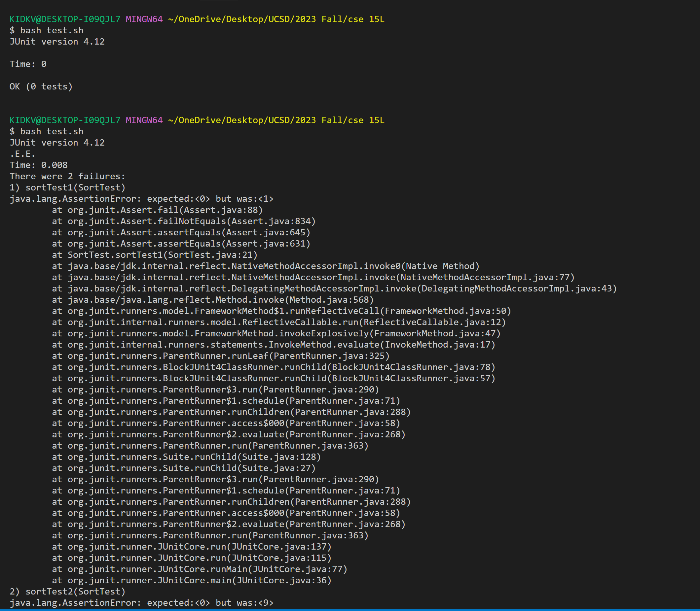
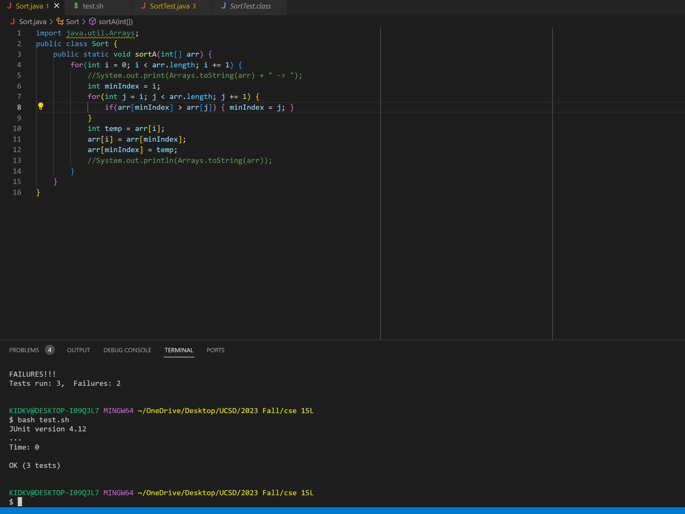

# Part 1

**symptom**
>I got an Assertion error saying that the first element of the sorted array does not seem correct base on the exception array, but I do not know what the error is. >Can you help me identify the error, please. My guess on the bug is that the array must be messed up because I swap the element of the array wrong, but I do not know if that is correct. Thank you!



**response**
>It is probably not that the array got messed up when you swap element. What can you see from the output symptom? The actual output is a lot bigger than the >expected output, but it should be the smallest element from what I can see in the output. Please check your Sort class methods and see if there is anything wrong, >go through your for loop again. 

**Fixed**
>I check the Sort class methods and find out that in the inner for loop, the if statement is wrong. I used `<` instead of `>`, therefore I sort the array from >biggest to smallest, while I want it to sort from smallest to biggest. After I changed it to `>`, it is sorting from small to big. Thank you so much



**Code Before**
*Sort.java*
````
import java.util.Arrays;
public class Sort {
    public static void sortA(int[] arr) {
        for(int i = 0; i < arr.length; i += 1) {
            //System.out.print(Arrays.toString(arr) + " -> ");
            int minIndex = i;
            for(int j = i; j < arr.length; j += 1) {
                if(arr[minIndex] < arr[j]) { minIndex = j; }
            }
            int temp = arr[i];
            arr[i] = arr[minIndex];
            arr[minIndex] = temp;
            //System.out.println(Arrays.toString(arr));
        }
    }
}
````
*SortTest.java*
````
import static org.junit.Assert.assertEquals;
import org.junit.Test;

public class SortTest {
    
    @Test
    public void sortTest(){
        int[] numArr = {0,0};
        int[] expArr = {0,0};
        Sort sortc = new Sort();
        sortc.sortA(numArr);
        assertEquals(expArr[0],numArr[0]);
    }

    @Test
    public void sortTest1(){
        int[] numArr = {1,0};
        int[] expArr = {0,1};
        Sort sortc = new Sort();
        sortc.sortA(numArr);
        assertEquals(expArr[0],numArr[0]);
    }

    @Test
    public void sortTest2(){
        int[] numArr = {4,6,9,2,6,2,3,6,9,1,0,4,6};
        int[] expArr = {0,1,2,2,3,4,4,6,6,6,6,9,9};
        Sort sortc = new Sort();
        sortc.sortA(numArr);
        assertEquals(expArr[0],numArr[0]);
    }
}

````
*test.sh*
````
javac -cp ".;lib/hamcrest-core-1.3.jar;lib/junit-4.12.jar" *.java
java -cp ".;lib/junit-4.12.jar;lib/hamcrest-core-1.3.jar" org.junit.runner.JUnitCore SortTest
````


# Part2

In the second half of the 15L, I deepened my understanding of markdown which I can make my github page look a lot better. During the class and lab, I learned jdb, write code in bash, commit, and push changes to git hub directly from command, vim. I think it is really useful to use the bash command because you don't need to type everything out again and again. It is also really useful to use vim when there is a lot of code and you are trying to find a specific place. I really like 15L. This class is really interesting and useful. 
